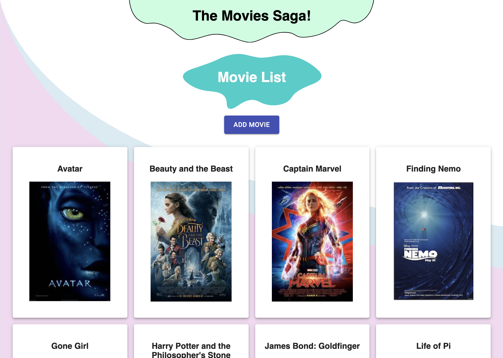

# Movie Gallery

## Description

*Duration: 2 day task*

An full-stack app for storing the details of a series of movies, adding new ones, and displaying them on a visually appealing homepage and details page.

I challenged myself to be creative with the styling on this one - hence the blobs :). Creating and importing them turned out to be easy, but transforming and positioning them exactly where I wanted compared to the text I wanted them behind ended up being the real challenge.

## Screenshot

;

## Prerequisites

- Node.js
- PostgreSQL

## Installation

1. Fork and clone repo
2. `npm install`
3. Follow the instructions and run the queries in `database.sql` to set up the database
4. Run `npm run server` in the terminal
5. Run `npm run client` in the terminal
6. The `npm run client` command will open up a browser window to view the app. Otherwise, use your browser to connect to localhost:3000/

## Usage

1. Navigate to the home url to view a gallery of the names and titles of movies stored in the database
2. Click on a movie to bring it up in the details page and view more information about it
3. From the homepage, click the Add Movie button to view a form for submitting a movie to the database.
4. Complete the form and press save to update the database with the new movie and return to the home screen, or press cancel to discard changes and leave the Add Movie page

## Built With

- React.js
- Express.js
- Redux
- Material UI

## Acknowledgments

Thanks to my instructors and peers at Prime, who have all helped to make this project a reality!

## Support

If you have suggestions or questions, please email me at rutherford.t.b@gmail.com!